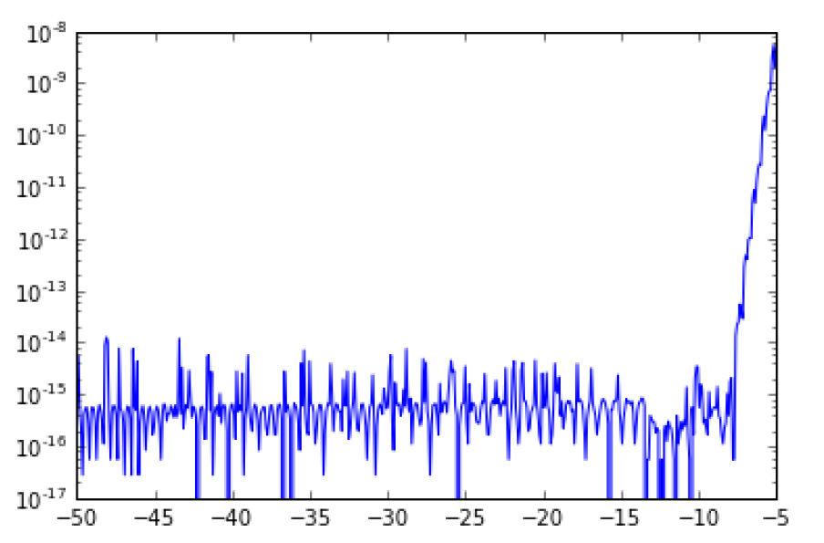

In this project I had to calculate the values of Airy functions - a case of transcendental functions.
That values were obtained using their Taylor and asymptotic expansions. We also had to compute their first few hundred roots (I used Newton's method)
  
  
Teaser - absolute error of the approximation with respect to x:

    

