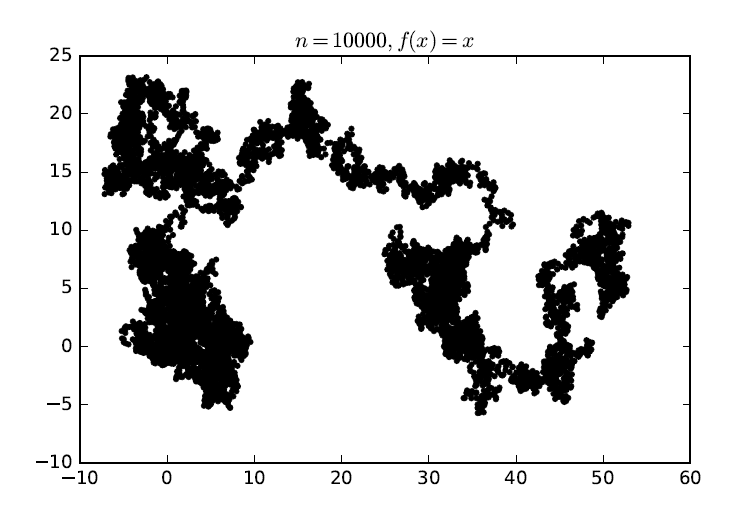

In this project I had to simulate random walks (jumps were distributed as power laws) and calculate some interesting statistics about them. As an extra, I also had to simulate "sticking time", when jumps don't happen immediately.

    

