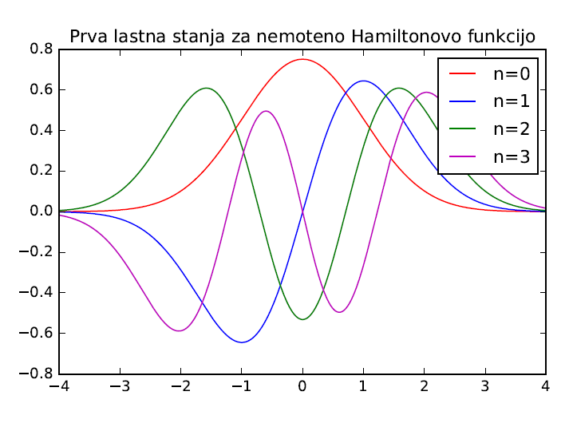

In this project I had to diagonalize a Hamiltonian to obtain eigenfunctions and eigenenergies. As a bonus, I had to also employ perturbation theory to analyze anharmonic potential.
In essence, it boiled down to numerical linear algebra.

    

