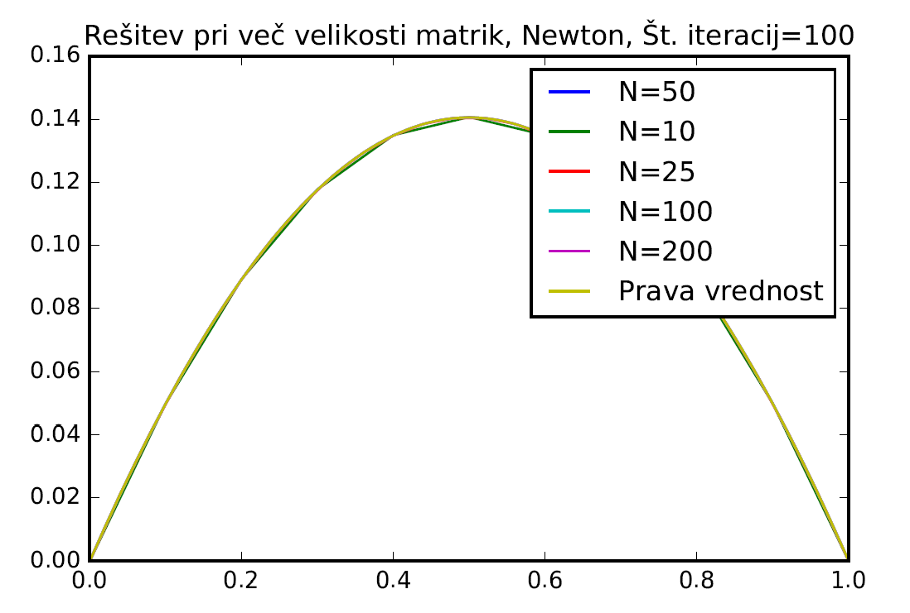

In this project I had to solve a boundary value problem (BVP) in one dimensions. I used a given iterative scheme, Newton's method and also the shooting method.

    

Solving the Boundary Value Problem (ODE) with Newton's and shooting method.
