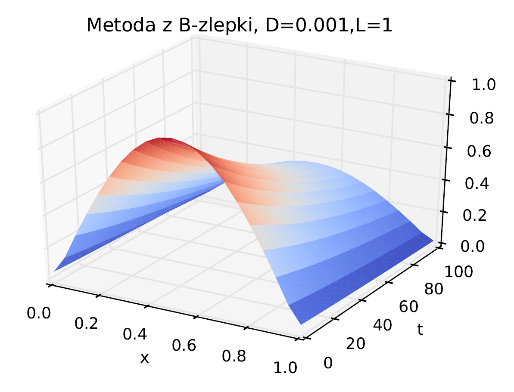

In this project I had to solve a partial differential equation (PDE) with spectral methods. I solved the heat equation, taking care of the spatial dimensions by expanding it in either
Fourier modes or the B-Splines.

    

